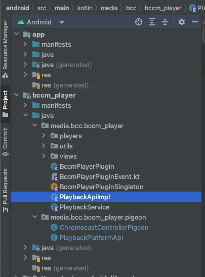

## Example guide: Implementing setVolume()

Here's a short guide on how to implement volume. I think it's a good example because it requires all these things:

- Generating code to communicate with the native side: Pigeons
- Writing native code: we will set the volume on the native AVPlayer/ExoPlayer
- Adding a new API to BccmPlayerController: we are going to add a setVolume() function.

This assumes you have followed the steps under "Basics" to get up and running with a local clone.

### Rough overview

Here are the steps in a rough overview:

- Generate a bunch of code with pigeon
- Implement the native api via PlaybackApiImpl.swift and PlaybackApiImpl.kt
- Call player.volume on AVPlayer/ExoPlayer/CastPlayer
- Use it in dart: Add a setVolume() to BccmPlayerInterface
- Override the BccmPlayerInterface.setVolume() method in BccmPlayerNative.
- Call BccmPlayerInterface.instance.setVolume() from BccmPlayerController

### 1. Generating the native code

In order to get type-safe code when communicating with the native side, bccm_player uses [pigeon](https://pub.dev/packages/pigeon). It also speeds up the process a bit because you don't have to write any method channel communication stuff yourself.

#### Open pigeons/playback_platform_pigeon.dart.

This is the main pigeon file and the most important bit is the "PlaybackPlatformPigeon" class.
Anything we add here will be callable from flutter and has to be implemented on the native side.

Let's add a setVolume() function somewhere, with a `double` to represent the volume from 0.0 to 1.0.
You almost always need to include a `playerId`, in order to know which player to work with (you'll see later).

We attribute the method with a @ObjCSelector with this syntax: `functionName:secondParam:`. This isn't strictly necessary but it helps keep the iOS code a bit cleaner.
The @async makes the generated dart code return a Future, allowing us to await it if necessary.

So something like this:

```dart
@HostApi()
abstract class PlaybackPlatformPigeon {
   // ... other methods

  @async
  @ObjCSelector("setVolume:volume:")
  void setVolume(String playerId, double volume);

   // ... other methods
}
```

_Tip: You can use advanced argument types (see MediaItem, etc), pigeon will generate iOS/Android code for those too. But everything needs to be defined inside this one .dart file, as 'import' is not supported._

After any edits to playback_platform_pigeon.dart we need to run pigeon to generate everything:

```sh
dart run pigeon --input pigeons/playback_platform_pigeon.dart
```

### 2. Android: Implementing setVolume()

In Android Studio, open the example project. In the project explorer, you'll find bccm_player.



Open the file called PlaybackApiImpl.kt. The class in that file should have an error saying something like:

```log
Class 'PlaybackApiImpl' is not abstract and does not implement abstract member public abstract fun setVolume(playerId: String, volume: Double, result: PlaybackPlatformApi.Result<Void!>)
```

Hovering the error and clicking "Implement members" will make android studio generate something like this:

```kotlin
override fun setVolume(
    playerId: String,
    volume: Double,
    result: PlaybackPlatformApi.Result<Void>
) {
    TODO("Not yet implemented")
}
```

Now we just need to implement it.
You can usually look at similar methods in the class and see how it's done. You usually just get the correct PlayerController based on the `playerId` argument, and call some method on that.

```kotlin
override fun setVolume(
    playerId: String,
    volume: Double,
    result: PlaybackPlatformApi.Result<Void>
) {
    val playbackService = plugin.getPlaybackService() ?: return
    val playerController = playbackService.getController(playerId)
        ?: return result.error(Error("Player with id $playerId does not exist."))

    playerController.setVolume(volume)
    result.success(null)
    // It's important to call result.error or result.success, otherwise the dart Future will never complete.
}
```

PlayerController.setVolume() doesn't exist yet, so open PlayerController.kt and add it:

```kotlin
fun setVolume(volume: Double) {
    val safeVolume = clamp(volume, 0.0, 1.0)
    player.volume = safeVolume.toFloat();
    pluginPlayerListener?.onManualPlayerStateUpdate()
}
```

PlayerController is just abstract and these classes are the real ones being used: ExoPlayerController/CastPlayerController.
If you need to add something more advanced which requires chromecast or exoplayer specific stuff, you can override the setVolume method in `ExoPlayerController.kt` or `CastPlayerController.kt`.

### 3. iOS: Implementing setVolume()

It's very similar to the android side, so I'll keep it concise:

1. Open PlaybackApiImpl.swift in xcode. It should have an error too; just implement the missing "setVolume" function with e.g.
   ```swift
   public func setPlaybackSpeed(_ playerId: String, speed: NSNumber, completion: @escaping (FlutterError?) -> Void) {
       let player = getPlayer(playerId)
       player?.setPlaybackSpeed(speed.floatValue)
       completion(nil)
   }
   ```
2. Open PlayerController.swift and add
   ```swift
   func setVolume(_ speed: Float)
   ```
3. On the iOS side, PlayerController is just a "protocol"/"interface", not an abstract class. So we need to open AVQueuePlayerController.swift to implement it:
   ```swift
   public func setVolume(_ volume: Float) {
       player.volume = volume
       /* Call onManualPlayerStateUpdate() to update the state (i.e. controller.value). */
       onManualPlayerStateUpdate()
   }
   ```
4. And for CastPlayerController.swift:
   ```swift
   public func setVolume(_ speed: Float) {
       guard let remoteMediaClient = GCKCastContext.sharedInstance().sessionManager.currentSession?.remoteMediaClient else {
           return
       }
       remoteMediaClient.setStreamVolume(speed) {
           let event = PlayerStateUpdateEvent.make(withPlayerId: self.id, snapshot: self.getPlayerStateSnapshot())
           self.playbackApi.playbackListener.onPlayerStateUpdate(event, completion: { _ in })
       }
   }
   ```

### 4. Flutter: Making setVolume() available

Now we have fully implemented the setVolume() pigeon, but it's not available on the PlayerController.

The flow is usually like this:

- BccmPlayerController (dart): `BccmPlayerInterface.setVolume();`
- BccmPlayerInterface (dart abstract class)
- BccmPlayerNative (implementation of BccmPlayerInterface): `_pigeon.setVolume();`

So we first gotta add it to the abstract BccmPlayerInterface and BccmPlayerNative.

#### Open playback_platform_interface.dart and add an empty implementation:

```dart
Future<void> setVolume(String playerId, double volume) {
    throw UnimplementedError('setVolume() has not been implemented.');
}
```

#### Open bccm_player_native.dart and override it:

```dart
@override
Future<void> setVolume(String playerId, double volume) {
    return _pigeon.setVolume(playerId, volume);
}
```

### 5. Finally

Open player_controller.dart and add the method there too:

````dart
/// Sets the volume. The value should be between 0.0 and 1.0.
/// The setting is kept across videos.
///
/// ```dart
/// controller.setVolume(1); // Will set to max volume.
/// ```
Future<void> setVolume(double volume) {
    return BccmPlayerInterface.instance.setVolume(value.playerId, volume);
}
````

### Conclusion

This guide covered how to implement setVolume() for all platforms: on the native AVPlayer (iOS), the native ExoPlayer (Android), and for chromecasts.

If you've followed along, you'll know now roughly know how to implement native code changes. This was a simple feature, but for more advanced features, we recommend looking around and imitating how similar use cases was solved.
